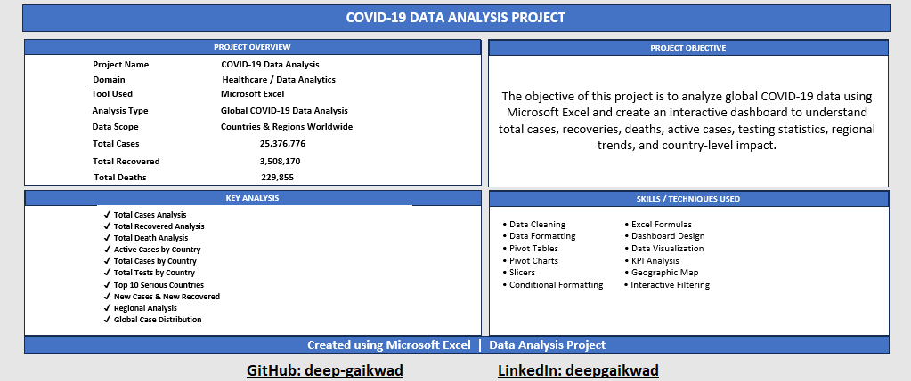

# 🦠 COVID-19 Data Analysis Dashboard | Excel

## 📊 Project Overview

This project is an interactive **COVID-19 Data Analysis Dashboard** developed using **Microsoft Excel**.

The dashboard transforms COVID-19 data into meaningful visual insights using charts, KPIs, filters, and interactive analysis.

The main objective of this project is to analyze COVID-19 trends and present important information through a clear and user-friendly dashboard.

---

## 🎯 Project Objectives

- Analyze COVID-19 data and identify important trends
- Track key COVID-19 statistics
- Compare COVID-19 cases across different locations
- Analyze cases and trends over time
- Create meaningful charts and visualizations
- Build an interactive Excel dashboard
- Present data-driven insights in a simple and professional format

---

## 🛠️ Tools & Technologies

- **Microsoft Excel**
- Data Cleaning
- Data Preparation
- Excel Formulas
- Pivot Tables
- Pivot Charts
- Data Visualization
- Dashboard Development

---

## 📌 Key Dashboard Features

- 📊 COVID-19 KPI Analysis
- 📈 Trend Analysis
- 🌍 Location-wise Analysis
- 📅 Time-based Analysis
- 📉 Interactive Charts
- 🔎 Filters and Data Exploration
- 📋 Summary Tables
- 📊 Interactive Excel Dashboard

---

## 📈 Analysis Covered

The dashboard provides insights into:

- COVID-19 Cases
- COVID-19 Trends
- Location-wise Data
- Time-wise Analysis
- Comparative Analysis
- Overall COVID-19 Statistics

---

## 🖼️ Dashboard Preview

### 🦠 COVID-19 Dashboard

### 📋 Project Information

---

## 📂 Project Files

| File / Folder | Description |
|---|---|
| `Covid_data_analysis_dashboard.xlsx` | Excel dashboard and analysis file |
| `Images/` | Dashboard and project information screenshots |
| `Readme.md` | Project documentation |

---

## 🔄 Data Analysis Process

The project follows a structured data analysis workflow:

**Raw Data → Data Cleaning → Data Preparation → Data Analysis → Pivot Tables → Data Visualization → Dashboard**

The data was prepared and analyzed in Excel before creating visualizations and the final interactive dashboard.

---

## 🚀 How to Use

1. Download or clone this repository.
2. Open `Covid_data_analysis_dashboard.xlsx` in Microsoft Excel.
3. Navigate to the dashboard sheet.
4. Use the available filters and interactive elements.
5. Explore the COVID-19 trends and insights through the dashboard.

---

## 📚 Skills Demonstrated

- Microsoft Excel
- Data Cleaning
- Data Preparation
- Excel Formulas
- Pivot Tables
- Pivot Charts
- Data Visualization
- Dashboard Development
- Data Analysis
- Business Reporting

---

## 👨‍💻 Author

**Deep Gaikwad**

Aspiring Data Analyst

**Skills:**  
Excel | SQL | Python | Power BI | Data Analysis

---

## ⭐ Conclusion

This project demonstrates how **Microsoft Excel can be used to transform raw COVID-19 data into an interactive and informative analytical dashboard**.

It showcases practical skills in data preparation, analysis, visualization, and dashboard development.

Thank you for visiting this project! ⭐

If you find this project useful, feel free to explore the repository.